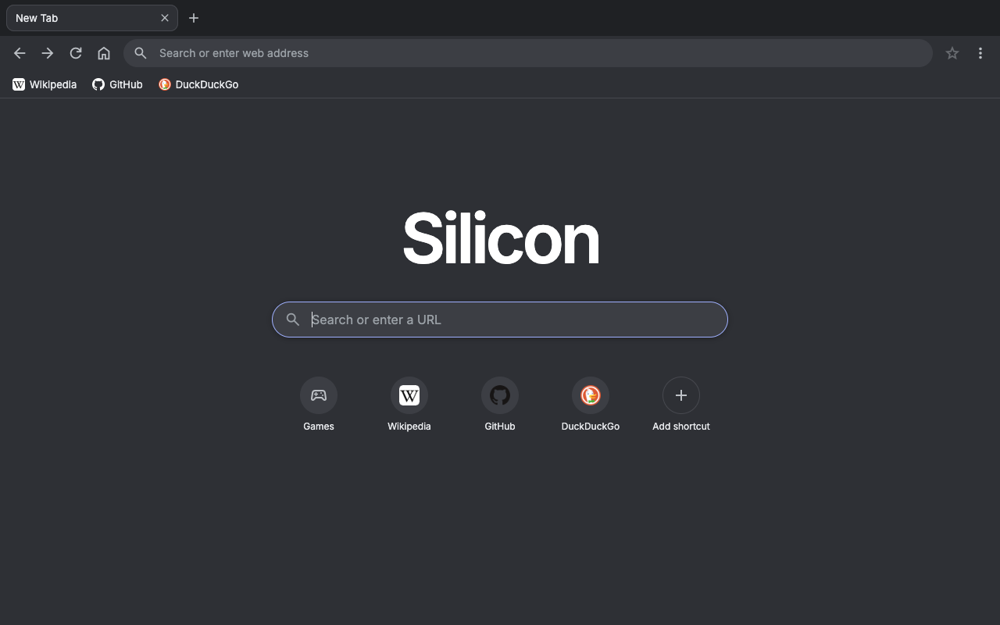
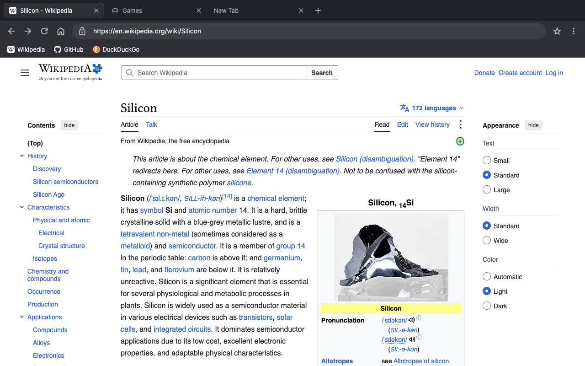
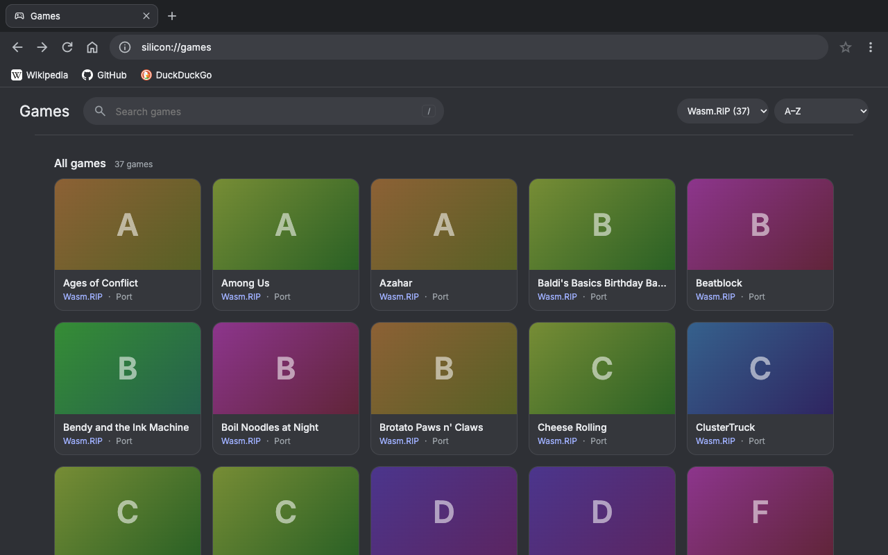
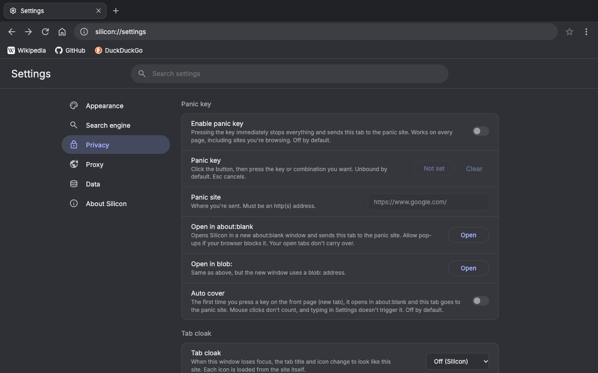

# Silicon

[](LICENSE)
[](https://nodejs.org/)


A self-hosted browser-in-a-tab and games launcher. You run it on your own computer or server, open it in any modern browser, and get tabs, bookmarks, history and a library of browser games, with sites and games loaded through the [Scramjet](https://github.com/MercuryWorkshop/scramjet) 2 web proxy. Express + Scramjet + a Wisp server in one process, with a vanilla HTML/CSS/JS frontend and no build step.

Source code: <https://github.com/Carbonine/silicon>

> **Experimental (v0.1 beta).** Silicon is early software. Expect rough edges, missing features and things that break when a website, a game source or the proxy changes. Don't rely on it for anything important, and don't enter passwords or other sensitive data on sites you reach through it unless you trust where it is hosted. See [Known limitations](#known-limitations).

| | |
| --- | --- |
|  |  |
|  |  |

*The games screenshot has the sources' cover art turned off.*

## Contents

- [Why use Silicon](#why-use-silicon)
- [Features](#features)
- [Quick start](#quick-start)
- [Running it on a server (VPS)](#running-it-on-a-server-vps)
- [Updating](#updating)
- [Configuration](#configuration)
- [Keyboard shortcuts](#keyboard-shortcuts)
- [Game sources](#game-sources)
- [Troubleshooting](#troubleshooting)
- [Known limitations](#known-limitations)
- [How it works](#how-it-works)
- [Project layout](#project-layout)
- [Contributing](#contributing)
- [Security](#security)
- [License](#license)

## Why use Silicon

- **You run it, so you control it.** No accounts, no ads, no analytics. Your settings, bookmarks, history and favorites stay in your own browser.
- **Browser and games in one place.** Browse the web and play games from one tab, with games from several sources collected in a single library.
- **Built for networks that block things.** Sites and games load through your own server's proxy, so a blocked game site or website can still work if your server can reach it.
- **Quick to hide.** A panic key, tab cloaking and cover windows are built in.
- **Small and simple.** One process, one `npm install`, no build step, no database. Games are fetched live and never saved to disk.
- **Free software.** AGPL-3.0, so you can read it, change it and share it.

## Features

**Browsing**
- Tabs you can drag to reorder, duplicate, close in bulk and reopen (up to the last 10 closed), with a right-click menu and middle-click to close. Tabs are not saved between sessions.
- An address bar that suggests bookmarks, history and `silicon://` pages as you type. It matches only on your device, and nothing you type is sent to a search engine until you press Enter.
- Back, forward, reload and home, a loading bar, and each tab shows the page's own icon.
- A choice of search engines: DuckDuckGo, Google, Bing, Brave, Startpage, Ecosia, Wikipedia, Yandex, or your own.
- Dark, light or system theme.
- A shortcuts row on the new tab page (each shows the site's own icon), and a three-dots menu with bookmarks, history, settings and a keyboard shortcuts guide.

**Bookmarks and history**
- A star in the address bar (Ctrl+D) bookmarks a page. Bookmarks show in a bar under the address bar, with a menu for the ones that don't fit. Right-click one to edit or delete it.
- `silicon://bookmarks` is a manager: add, edit, reorder (drag or arrows), search and delete.
- `silicon://history` lists the pages you've opened by day, with search, single-entry removal and clearing by time range. Turn it off in Settings.

**Games**
- A library fed live by several sources (see [Game sources](#game-sources)). One source is shown at a time, biggest first, with search, category chips, sorting, favorites, "continue playing", and rows for new and popular games where a source provides them.
- A game player with refresh, fullscreen and back buttons, and a shield button that switches between loading the game through the proxy (default) and loading it directly. Your choice is remembered per game.
- Games from sources can be hidden by adding them to `server/games-hidden.json`, with a note on why.

**Privacy and stealth**
- **Panic key:** one key press sends the tab to a page of your choice, on every page.
- **Tab cloak:** the tab title and icon change to look like another site (Google, Wikipedia, GitHub, Khan Academy, Canvas, Notion, Quizlet, or your own with a title and an icon address) when the window loses focus, or all the time. Each icon is loaded from the site itself.
- **Cover windows:** open Silicon inside `about:blank`, and optionally do it automatically on the first key press from the front page.
- **Confirm before leaving:** asks before the tab is closed or reloaded.

**Your data**
- Settings, bookmarks, history and favorites live in your browser's `localStorage`. Settings has export and import for a JSON backup, plus a danger zone to clear data or reset settings.
- **Game saves:** games loaded through the proxy keep their saves in your browser (local storage and IndexedDB). Settings → Data → Game saves exports them to a file and imports them back, with a list to choose what goes in. Binary saves are supported, and cache-like databases are left unticked by default.

**Proxy**
- Scramjet 2, with the Epoxy or libcurl transport (switch in Settings), an optional upstream SOCKS5 or HTTP proxy (libcurl only), and an option to use a different Wisp server.

## Quick start

Requires [Node.js](https://nodejs.org/) 18 or newer and git.

```sh
git clone https://github.com/Carbonine/silicon.git silicon
cd silicon
npm install
npm run dev
```

Then open <http://localhost:3000>.

- `npm run dev` starts everything in one process and restarts when files change. `npm start` runs the same server without the file watcher.
- No API keys or cloud accounts are needed.
- It listens on `127.0.0.1` by default, so only your own machine can reach it. This is the recommended way to run Silicon.

## Running it on a server (VPS)

Do the same thing on the server, then expose it safely:

```sh
git clone https://github.com/Carbonine/silicon.git silicon
cd silicon
npm install --omit=dev
HOST=127.0.0.1 PORT=3000 NODE_ENV=production node server/index.js
```

1. **Keep it running.** Use systemd, pm2 or similar. A minimal systemd unit:

   ```ini
   [Unit]
   Description=Silicon
   After=network.target

   [Service]
   WorkingDirectory=/opt/silicon
   Environment=NODE_ENV=production HOST=127.0.0.1 PORT=3000
   ExecStart=/usr/bin/node server/index.js
   Restart=on-failure
   User=silicon

   [Install]
   WantedBy=multi-user.target
   ```

2. **Put HTTPS in front of it.** Service workers only run on `http://localhost` or over HTTPS, so Silicon will not work on a plain `http://your-server` address. A Caddy example (it handles HTTPS and WebSockets for you):

   ```
   silicon.example.com {
       reverse_proxy 127.0.0.1:3000
   }
   ```

   With nginx, forward WebSocket upgrades (`proxy_http_version 1.1; proxy_set_header Upgrade $http_upgrade; proxy_set_header Connection "upgrade";`) for the whole site, including `/wisp/`.

3. **Limit who can use it.** Silicon has no login. Anyone who can reach it can send traffic out through your server's connection. Restrict access with your firewall, a VPN, or basic authentication in your reverse proxy (for example Caddy's `basic_auth`).

Some things to know: many datacenter IP addresses are blocked or challenged by large sites, and the Wisp server refuses loopback and private addresses by default, so the proxy can't be used to reach other services on your server.

## Updating

Silicon doesn't update itself, and it never contacts GitHub to check. Each version is listed in the [changelog](CHANGELOG.md) and under the repository's Releases.

1. **Read the [changelog](CHANGELOG.md)** for the versions you're skipping. Anything you have to do, such as a new setting or a change to saved data, is noted there.
2. **Optional but sensible:** in Settings → Data, press **Export data** (and **Export game saves** if you play games through the proxy) first, so you have a backup.
3. **Get the new code,** from the Silicon folder:

   ```sh
   git pull
   npm install
   ```

   `npm install` only matters when the dependencies changed, but it's safe to run every time. If git complains about local changes, commit or stash them first.
4. **Restart the server.** If you started it with `npm run dev`, it restarts by itself when files change. With `npm start`, stop it and start it again. On a VPS, restart the service, for example `sudo systemctl restart silicon`.
5. **Reload Silicon in your browser.** A hard refresh (Ctrl+Shift+R, or Cmd+Shift+R on a Mac) makes sure the browser isn't using old files.

Your settings, bookmarks, history, favorites and game saves are kept in your browser, not in the Silicon folder, so updating doesn't touch them. Your `.env` file is yours and isn't overwritten either; compare it with `.env.example` after an update in case a new option was added.

If you downloaded a zip instead of cloning, download the new version, copy your `.env` over if you made one, run `npm install`, and start it. Cloning with git is the easier way to stay up to date.

## Configuration

All optional. Copy `.env.example` to `.env` to change anything.

| Variable | Default | What it does |
| --- | --- | --- |
| `PORT` | `3000` | Port to listen on |
| `HOST` | `127.0.0.1` | `127.0.0.1` = this machine only. `0.0.0.0` = anyone who can reach the machine can use the proxy |
| `PROXY_PREFIX` | `/proxy/` | URL path the proxy uses |
| `WISP_PATH` | `/wisp/` | URL path of the Wisp (WebSocket) endpoint |
| `GAMES_REFRESH_MINUTES` | `30` | How often the game lists are fetched again |
| `SELENITE_URL`, `GNMATH_URL`, `TRUFFLED_URL`, `SERAPH_URL`, `CKV_URL`, `WASMRIP_URL` | each source's own site | Use a mirror instead |

## Keyboard shortcuts

The three-dots menu has the full list. The main ones:

| Action | Keys |
| --- | --- |
| New tab / close tab | Ctrl+T, Ctrl+W (or Alt+T, Alt+W) |
| Reopen closed tab | Ctrl+Shift+T (or Alt+Shift+T) |
| Next / previous tab | Ctrl+Tab, Ctrl+Shift+Tab (or Alt+], Alt+[) |
| Go to tab 1 to 8 / last tab | Ctrl+1 to 8, Ctrl+9 (or Alt+1 to 9) |
| Bookmark this page | Ctrl+D |
| Bookmarks / bookmarks bar | Ctrl+Shift+O / Ctrl+Shift+B |
| History | Ctrl+H |
| Search a library page | `/` |

Ctrl is the key on a Mac too. On Windows and Linux, browsers usually keep the Ctrl tab shortcuts (T, W, Tab, 1 to 9) for themselves, so they only work where the browser lets them through. The Alt versions always work.

## Game sources

Games are not stored in this repository or on your disk. Each source is read live from its own site when the server starts and again every `GAMES_REFRESH_MINUTES`, and kept in memory only:

| Source | Site |
| --- | --- |
| Selenite | selenite.cc |
| GN-Math | gn-math.dev |
| Truffled | truffled.lol |
| Seraph | ijnfem.github.io/seraph |
| CKV (Chicken King's Vault) | wanocapy.github.io/ChickenKingsVault |
| Wasm.RIP | wasm.rip |
| Silicon | games hosted by this server in `public/games/` (see `public/games/games.json`). Empty by default, and hidden until you add one |

**Silicon does not host, own or control these games or sites.** It only links to them and, by default, loads them through your own server's proxy. Their content belongs to their authors and sites, and a source can change or disappear at any time. You are responsible for the sources you enable and for following the rules of the sites and networks you use.

**If a game doesn't load or doesn't work, that is usually the game's source, not Silicon.** Silicon only passes the game along. Each game is hosted by its source (and often loads its files from other sites), so a game can be broken, slow or missing no matter how you open it. A good test is the shield button in the player: if the game fails both through the proxy **and** loaded directly, the problem is on the source's side (for example the game was taken down, a file it needs is blocked, or the site is down) and Silicon can't fix it. Only a game that works one way but not the other points to a proxy problem, and that's worth reporting. Games that are known to be broken can be left out with `server/games-hidden.json`.

To add a source, write an adapter in `server/games.js` (an async function that returns a list of games) and register it in `SOURCES`.

## Troubleshooting

- **"Can't reach this site".** When a site can't be loaded, Silicon shows this page with a likely cause and three buttons: Reload, Try the other transport (Epoxy or libcurl, switched for you) and Home. "Technical details" has the raw error. If it happens on every site, the connection to the proxy itself is failing: if you're not on `localhost` make sure you're using HTTPS, and check that the server is running.
- **A game stays on its loading screen or is blank.** Press the shield button in the player to switch between the proxy and a direct load. Emulator-based games work best when loaded directly. If it fails both ways, the game itself is broken at its source (see [Game sources](#game-sources)), not something Silicon can fix.
- **Other devices on my network can't reach it.** The default `HOST=127.0.0.1` only allows this machine. Set `HOST=0.0.0.0`, and remember the proxy then works for everyone who can reach it. Service workers still need HTTPS on any address that isn't `localhost`.
- **"Address already in use".** Another program is on that port. Set a different `PORT`.
- **A game source is empty.** Its site may be down or blocked from your server. The other sources keep working, and it is fetched again at the next refresh.
- **I lost my bookmarks or settings.** They live in your browser's site data. Clearing it removes them, so use Settings → Export data for a backup.

## Known limitations

- Some sites don't work through the proxy, especially ones that need WebRTC, DRM video, heavy sign-in flows, or that detect and block proxies. Sites that refuse to be loaded in a frame can behave differently.
- Emulator-based games load their core in a background worker, which doesn't work through the proxy yet, so they default to loading directly (and may be blocked on restrictive networks).
- Games depend on their source sites. If a source is slow, rate-limited or down, its list may be empty until the next refresh. Individual games can also be broken at the source, for example when they load files from a third-party host that has gone offline or blocked them (jsDelivr currently blocks the `gn-math` asset account, so games that use it don't load). A game that fails both through the proxy and loaded directly is a source problem, not a Silicon one.
- Saved game data, bookmarks, history and settings live in your browser. Clearing site data removes them, so export your game saves if they matter. Game saves only cover games loaded through the proxy (a game loaded directly keeps its saves under its own site, which Silicon can't reach).
- Bookmarks are a flat list (no folders), and there are no accounts or sync.
- Silicon is not a full replacement for a browser: no extensions, no downloads manager, no find-in-page.
- Only tested in recent Chromium-based browsers.
- Icons on the new tab shortcuts are found and fetched by your server from the site itself (and cached in memory for a few hours). Some sites have no icon the server can reach, and then the tile shows a globe. Tab cloak icons are loaded by your browser from the sites themselves, and the custom cloak needs an icon address you provide.

## How it works

Scramjet is service-worker based. The page's frames load `/proxy/<encoded-url>`, and the service worker (`public/sw.js`) rewrites those requests and sends them through a **Wisp** WebSocket on this server, using the **Epoxy** or **libcurl** transport. Because the rewriting happens in the browser, `curl` against a `/proxy/...` address does not return a site's page. If a request reaches Express without the worker, `/proxy/https://example.com` redirects to `/?url=https://example.com`, which starts the worker and opens the site.

Each tab is an iframe. `silicon://` pages are ordinary pages served at `/silicon/<name>`, so the iframe's own history gives back and forward across internal pages and sites alike.

## Project layout

```
server/index.js          Express app, static files, listen
server/proxy.js          Wisp server, Scramjet/transport assets, /proxy/ fallback
server/icons.js          Finds and serves a site's own icon for the new tab shortcuts
server/games.js          Game sources (one adapter each), API, cover passthrough
server/games-hidden.json Game ids to leave out of the library
public/sw.js             Scramjet service worker
public/index.html        The browser shell
public/js/app.js         Shell: tabs, address bar, bookmarks, menus, settings, privacy tools
public/js/proxy-client.js  Browser side of the proxy (init, transport, frames)
public/js/saves.js       Game saves export and import
public/silicon/          silicon:// pages (newtab, games, play, bookmarks, history, settings, error)
public/css/              theme.css (colors/fonts), style.css (shell), pages.css (pages)
public/games/            Games hosted by this server
docs/screenshots/        The screenshots shown above
CHANGELOG.md             What changed in each version
```

To add an internal page, create `public/silicon/NAME.html` with `data-silicon="NAME"` on `<html>` and add `NAME` to `INTERNAL` in `public/js/app.js`.

## Contributing

Bug reports, ideas and pull requests are welcome. Please open an issue first for anything big, so we can agree on it before you spend time on it.

- **Reporting a problem:** say what you did, what you expected, and what happened, plus your browser and whether you run Silicon on `localhost` or a server. For a game that won't load, try the shield button in the player first: if it fails both through the proxy and loaded directly, it's the game's source, not Silicon (see [Game sources](#game-sources)).
- **Changing the code:** fork the repository, make a branch, and open a pull request. Silicon is plain HTML, CSS and JavaScript with no build step and no frontend framework, so please keep it that way and match the style of the code around your change. Test by hand in a browser: run it with `npm run dev`, and try your change on both the dark and light themes. Please don't add a dependency without talking about it first.
- **Adding a game source:** write an adapter in `server/games.js` and register it in `SOURCES` (see [Game sources](#game-sources)). Sources are read live and kept in memory, never copied into the repository.
- **The changelog:** if your change is something users would notice, add a line to `CHANGELOG.md` under "Unreleased".
- **Licensing:** by contributing you agree that your work is released under the same AGPL-3.0 license as the rest of Silicon.

## Security

Silicon is a web proxy, so please be careful with it: run it on `localhost` or behind access control (see [Running it on a server](#running-it-on-a-server-vps)).

If you find a security problem, **please report it privately and don't open a public issue.** Use [**Report a vulnerability**](https://github.com/Carbonine/silicon/security/advisories/new) (on the repository page: **Security** tab, then **Report a vulnerability**). Only the maintainers can see what you send, and we can work on a fix together before anything is made public. Examples worth reporting: a way to make the server reach its own machine or a private network (the Wisp server and the icon fetcher are meant to refuse that), a way to run script in Silicon's own pages, or a way to read another user's saved data. Problems inside Scramjet, Wisp or a transport belong with [Mercury Workshop](https://github.com/MercuryWorkshop) instead, and a site or game that simply doesn't work through the proxy isn't a security issue.

Silicon is a beta, so there is no support schedule: fixes go into the latest version.

## License

Silicon is free software under the **GNU Affero General Public License v3.0** (AGPL-3.0-only). See [LICENSE](LICENSE). Copyright (C) 2026 Carbonine.

The AGPL applies to Silicon and requires that people who use a modified copy of it over a network can get that copy's source code. If you run a modified Silicon for other people, make your source available to them.

### Third-party software

Silicon is built on these projects, used under their own licenses:

| Project | License |
| --- | --- |
| [Scramjet](https://github.com/MercuryWorkshop/scramjet), scramjet-controller, scramjet-utils | AGPL-3.0 |
| Epoxy transport, libcurl transport | AGPL-3.0 |
| [wisp-js](https://github.com/MercuryWorkshop/wisp-js) | LGPL-3.0-or-later |
| proxy-transports | MIT |
| Express, compression | MIT |
| dotenv | BSD-2-Clause |
| [Material Symbols](https://github.com/marella/material-symbols) (icons) | Apache-2.0 |
| [Inter](https://rsms.me/inter/) via Fontsource (font) | SIL OFL 1.1 |

The proxy engine is by [Mercury Workshop](https://github.com/MercuryWorkshop). Silicon is not affiliated with or endorsed by them or by any of the game sources above.